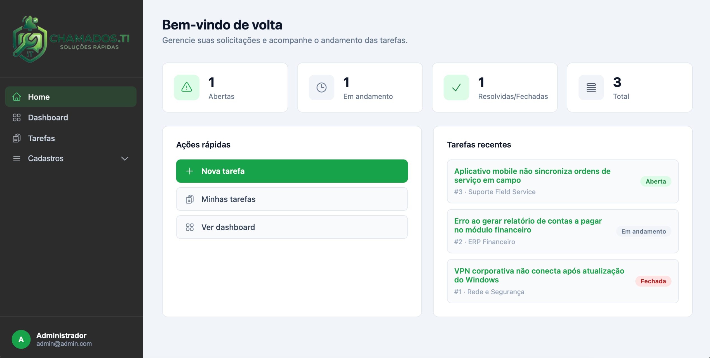
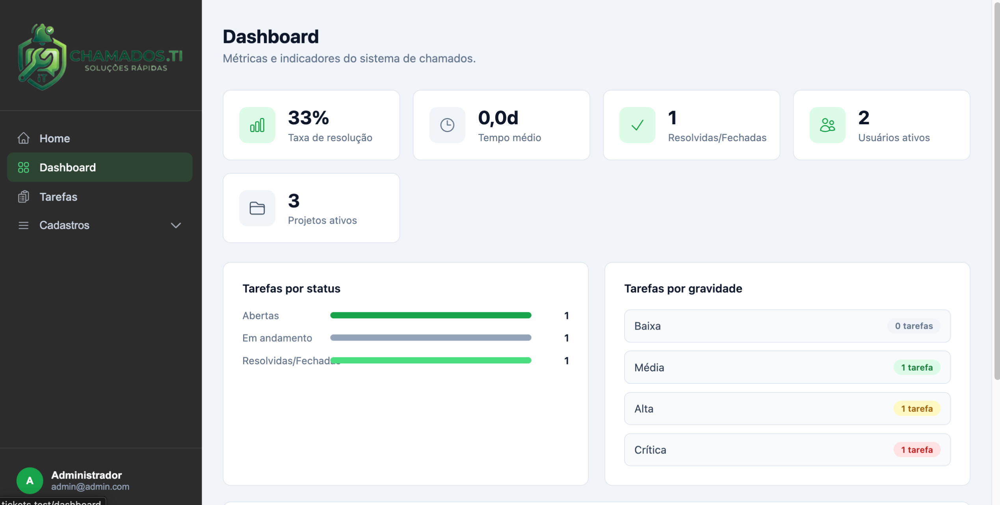
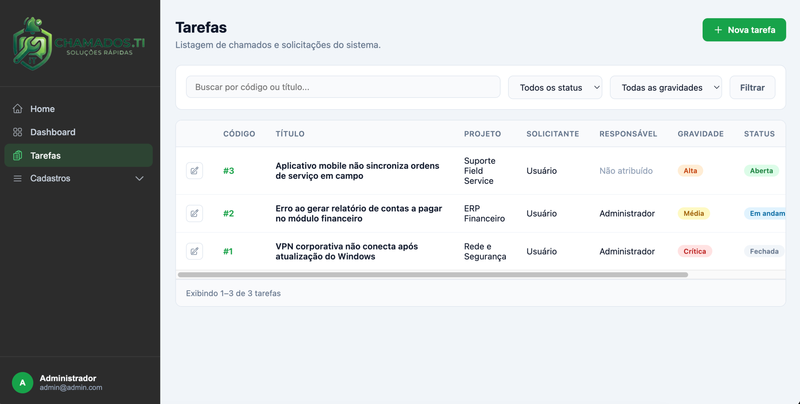
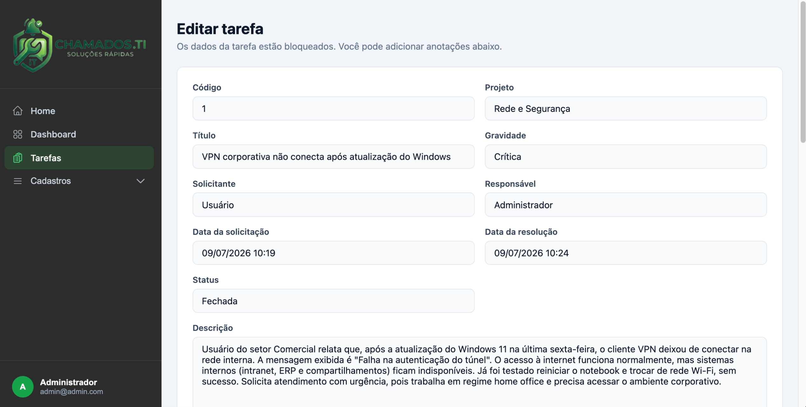
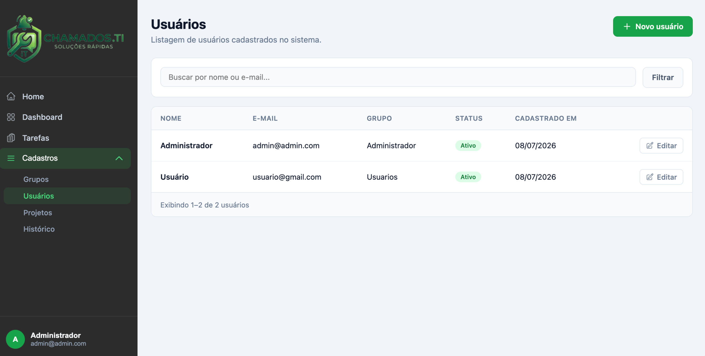
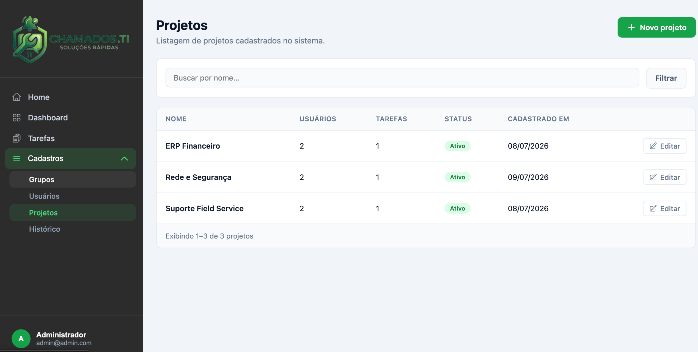
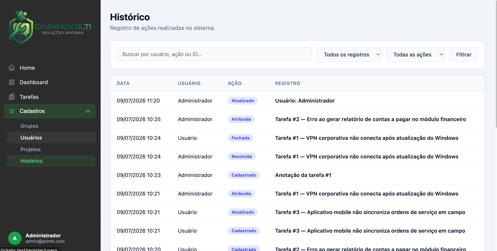

# Chamados.TI

<!-- Banner principal: docs/screenshots/banner.png -->


Sistema de gerenciamento de chamados desenvolvido em Laravel. Permite controlar solicitações por projeto, atribuir tarefas a usuários, registrar anotações com anexos, acompanhar métricas operacionais e consultar o histórico de ações do sistema.

## Capturas de tela

### Login


### Home

 

### Dashboard

 

### Tarefas

 

 

### Cadastros

 

 

### Histórico

 

## Funcionalidades

### Autenticação e layout
- Login com validação de usuário ativo
- Rotas protegidas por middleware `auth`
- Layout principal com menu lateral e conteúdo em iframe
- Menu lateral exibe nome e e-mail do usuário logado
- Página de conta do usuário logado

### Home e dashboard
- **Home** com cards de resumo (abertas, em andamento, resolvidas/fechadas e total)
- Tarefas recentes com link para edição
- Ações rápidas (nova tarefa, listagem e dashboard)
- **Dashboard** com taxa de resolução, tempo médio, usuários/projetos ativos
- Gráficos por status, gravidade e atividade da semana
- Dados filtrados pelos projetos vinculados ao usuário logado

### Cadastros (`/register`)
- Visível no menu apenas para usuários do grupo `ADMIN`
- CRUD de grupos, usuários e projetos
- Vínculo de usuários a projetos (repeater no formulário de usuário)
- **Histórico** — listagem centralizada de todas as ações registradas no sistema, com filtros por busca, tipo de registro e ação

### Tarefas
- CRUD de chamados com código sequencial no sistema
- Anexo da tarefa (armazenamento em `storage/app/public`)
- Fluxo de status: `open` → `in_progress` → `resolved` → `closed`
- Anotações com autor automático (usuário logado), anexos e repeater na edição
- Projetos disponíveis limitados aos vinculados ao usuário

### Histórico de auditoria
- Registro automático de ações via `HistoryService`
- Ações registradas: `created`, `updated`, `deleted`, `assigned`, `resolved`, `closed`
- Entidades auditadas: usuários, projetos, tarefas e anotações
- Exibição do histórico nos formulários de edição (usuário, projeto, tarefa e anotação)
- Listagem geral em **Cadastros → Histórico** (somente admin)

### Regras de negócio
| Regra | Comportamento |
|-------|---------------|
| Menu Cadastros | Visível apenas para grupo `ADMIN` |
| Atribuir a mim / Resolvido | Apenas grupos `ADMIN` e `SUPORTE` |
| Tarefa não aberta | Campos bloqueados; só anotações editáveis |
| Tarefa fechada | Tudo somente leitura, inclusive anotações |
| Exclusão de tarefa | Usuários só excluem tarefas abertas; administrador exclui em qualquer status |
| Edição de anotação | Somente o usuário que criou a anotação |
| Projetos no formulário | Limitados aos vinculados ao usuário logado |

### Grupos padrão
| Código | Descrição |
|--------|-----------|
| `ADMIN` | Administrador |
| `SUPORTE` | Suporte |
| `USUARIOS` | Usuários |

### Pendente
- Envio de e-mail

## Tecnologias

- PHP 8.1+
- Laravel 10
- Laravel Sanctum
- Vite
- PostgreSQL

## Estrutura do banco

| Tabela | Descrição |
|--------|-----------|
| `groups` | Grupos de usuários |
| `users` | Usuários do sistema |
| `projects` | Projetos |
| `project_user` | Vínculo usuário ↔ projeto |
| `tasks` | Chamados/tarefas |
| `task_notes` | Anotações e anexos das tarefas |
| `histories` | Log de auditoria (ações nos registros) |

## Estrutura do projeto

```
app/
├── Http/Controllers/
│   ├── Auth/LoginController.php
│   ├── DashboardController.php
│   ├── GroupController.php
│   ├── HistoryController.php
│   ├── HomeController.php
│   ├── ProjectController.php
│   ├── TaskController.php
│   ├── TaskNoteController.php
│   └── UserController.php
├── Models/
└── Services/
    ├── HistoryService.php        # Registro de ações de auditoria
    └── TaskStatsService.php      # Consultas compartilhadas home/dashboard

resources/views/
├── auth/                         # Login
├── layouts/                      # Menu principal
├── home/                         # Página inicial
├── dashboard/                    # Dashboard
├── account/                      # Minha conta
├── register/
│   ├── groups/                   # Grupos
│   ├── users/                    # Usuários
│   ├── projects/                 # Projetos
│   └── project-user/             # Vínculo usuário-projeto
├── tasks/                        # Tarefas
├── task-notes/                   # Anotações
└── histories/                    # Listagem e partials de histórico
```

## Instalação

```bash
# Clonar o repositório e entrar na pasta
cd tickets

# Instalar dependências
composer install
npm install

# Configurar ambiente
cp .env.example .env
php artisan key:generate

# Configurar banco PostgreSQL no .env e rodar migrations
php artisan migrate

# Link simbólico para anexos públicos
php artisan storage:link

# Compilar assets
npm run dev
```

### Acesso inicial

Após as migrations, é criado um usuário administrador padrão:

| Campo | Valor |
|-------|-------|
| E-mail | `admin@admin.com` |
| Senha | `admin` |

Com [Laravel Herd](https://herd.laravel.com), o projeto pode ser acessado em `http://tickets.test`.

## Rotas principais

| Rota | Descrição |
|------|-----------|
| `/` | Redireciona para login |
| `/login` | Tela de autenticação |
| `/menu` | Layout com menu e iframe |
| `/home` | Home com resumo e tarefas recentes |
| `/dashboard` | Dashboard com métricas |
| `/tasks` | Listagem de tarefas |
| `/tasks/create` | Nova tarefa |
| `/tasks/{task}/edit` | Edição de tarefa |
| `/account` | Dados da conta logada |
| `/register/groups` | Cadastro de grupos |
| `/register/users` | Cadastro de usuários |
| `/register/projects` | Cadastro de projetos |
| `/register/histories` | Histórico geral do sistema (admin) |

## Desenvolvimento

```bash
# Servidor de desenvolvimento (Vite)
npm run dev

# Build para produção
npm run build

# Rodar testes
php artisan test
```

## Paleta visual

- Verde primário: `#16a34a`
- Sidebar: `#2C2C2C`
- Fundo da área de conteúdo: `#f1f5f9`

## Licença

Este projeto é open-source sob a licença [MIT](https://opensource.org/licenses/MIT).
